# RoomMate-FE 🏠🤝 
충북대학교 기숙사 **룸메이트 매칭 애플리케이션** Front-End 레포입니다.  

> - BE: https://github.com/Wootae01/RoomMate-BE
---

## 목차
- [프로젝트 소개](#프로젝트-소개)
- [주요 기능](#주요-기능)
- [기술 스택](#기술-스택)
- [화면 미리보기](#화면-미리보기)
- [환경 변수](#환경-변수) - 추후업데이트 예정

---

## 프로젝트 소개
기숙사 룸메이트를 구할 때 발생하는 **생활 패턴 차이(취침/기상, 청결, 소음 등)** 문제를 줄이기 위해,  
사용자 입력 정보를 기반으로 **룸메이트 후보를 추천/매칭**해주는 모바일 애플리케이션입니다.

**이용 흐름**
1. 회원정보 입력(기본 정보 / 본인 생활 패턴 / 룸메이트 선호 패턴)
2. 매칭 후보 추천 및 조회
3. 필터 기능으로 추천 목록 갱신
4. 1:1 채팅으로 매칭 진행

**기대 효과**
- 탐색 시간 대폭 단축 
- 추천 리스트에서 채팅으로 빠른 전환 (앱 일원화)
- 푸시 알림으로 응답 지연 감소
---

## 주요 기능
- 회원가입 / 로그인 (소셜 로그인 & JWT)
- 프로필 등록 및 수정
- 회원정보 입력 (본인 생활 패턴 & 룸메이트 선호 특성)
- 매칭 후보 추천 및 조회
- 상대 프로필 상세 보기
- 필터 기능으로 추천 목록 갱신
- 추천 상대와 채팅
- 채팅 푸시 알림

---

## 기술 스택
- **Mobile**: React Native
- **Tooling**: Expo / EAS
- **Language**: JavaScript
- **Code Style**: ESLint / Prettier

---

## 화면 미리보기

### 회원가입 / 로그인
| 화면 |
|---|
| 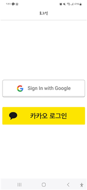 |

---

### 회원정보 입력
| 기본 정보 | 본인 생활 패턴 | 룸메이트 선호 패턴 |
|---|---|---|
| 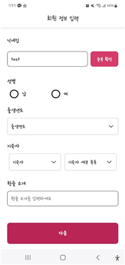 | 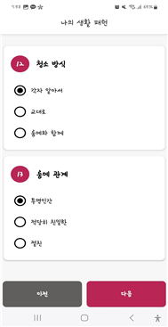 | 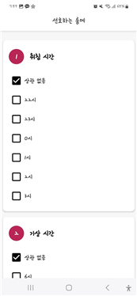 |

---

### 매칭 리스트 & 기능
| 추천 리스트 | 필터 기능 |
|---|---|
| 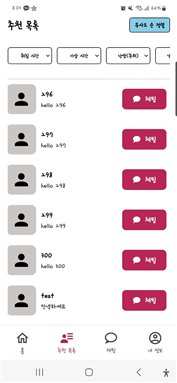 | 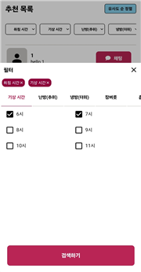 |

---

### 상대방 프로필 확인
| 프로필 1 | 프로필 2 |
|---|---|
| 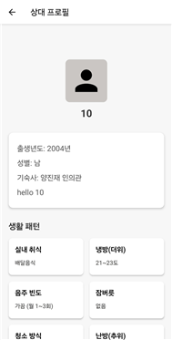 | 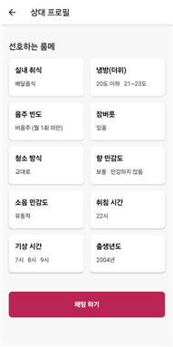 |

---

### 채팅 기능
| 채팅 목록 | 채팅 |
|---|---|
| 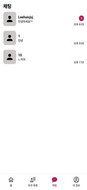 | 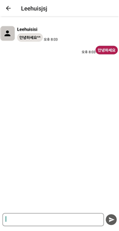 |

---

### 내 정보 수정
| 내 정보 |
|---|
| 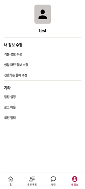 |

---

